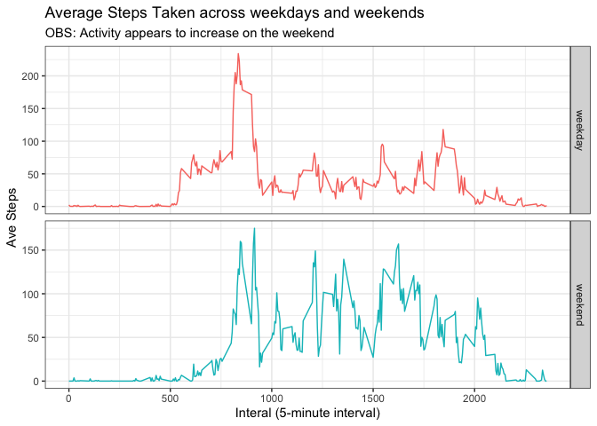

## Setting up Environment
This short section included libraries used in the analysis and creates a function  
used later in the analysis. I have hidden the library loading messages.

```r
# Libraries used in this project
library(readr)
library(lubridate)
library(dplyr)
library(ggplot2)
# Function to convert interval into elapsed minutes
elapsedmin <- function(x){
  e <- ifelse(nchar(x)<=2,paste('00:',x, sep = ""), 
              paste(substr(x,1,nchar(x)-2),":",substr(x, nchar(x)-1, nchar(x)), sep = ""))
  e
}
```

## Loading and preprocessing the data
Function read_csv will open the zip file and read the enclosed file.
preprocessing steps:
* Set NA value in  datafram.  
* Load activity data.  
* Add a variable that identifies dates as weekdays and weekends (used later).  
* Format interval string data into hhmm and use hm() later to convert the string into elapsed time.  


```r
# 
d_activity <- read_csv("activity.zip", col_names = TRUE, na = c("NA"))
weekdays1 <- c('Monday', 'Tuesday', 'Wednesday', 'Thursday', 'Friday')
d_activity$wday <- c('weekend', 'weekday')[(weekdays(d_activity$date) %in% weekdays1)+1L]
d_activity$hhmm <- ifelse(nchar(d_activity$interval)<4,paste0(0,d_activity$interval),d_activity$interval)
```

## What is the median and mean (central tendency) total number of steps taken per day?
Create a dataframe with columns date, day (weekend/weekday), tsteps (total steps)
* Aggregate the daily actiity (total steps / day)    
* Calculate and print central tendency (median & mean)  
* Provide a Histograme of total steps/day  


```r
a_stepsdays <- aggregate(d_activity$steps, by = list(d_activity$date, d_activity$wday), FUN = sum)
colnames(a_stepsdays) <- c("date", "day", "tsteps")
# Central Tendency
summary(a_stepsdays$tsteps)[3:4]
```

```
##   Median     Mean 
## 10765.00 10766.19
```

```r
# Histogram of the total number of steps taken each day ##### 

hist(a_stepsdays$tsteps,
     main = "Histogram of Total Steps/Day",
     xlab = "Total Steps/Day"
     )
```

<!-- -->


## What is the average daily activity pattern?

Following plot show daily acitivity averaged over all days (weekdays and weekends).  
* Create a dataframe that averages data across dates to create averages interval data.  
* Create an x-axis based upon elapsed minutes 1435 minutes (0-23:55).


```r
# Average over all days
d_stepsByIntveral <- d_activity %>% group_by(interval) %>% summarize(avgSteps = mean(steps, na.rm = TRUE))
# Elapsed minutes of a day (1435 minutes)
d_stepsByIntveral$telapsed <- hm(elapsedmin(d_stepsByIntveral$interval))
d_stepsByIntveral$elapsed <- hour(d_stepsByIntveral$telapsed)*60 + minute(d_stepsByIntveral$telapsed)

plot(d_stepsByIntveral$elapsed, d_stepsByIntveral$avgSteps, type = "l",
     xlab = "Elapsed Minutes",
     ylab = "Average Steps",
     main = "Timeseries of Averages Steps Over the Day")
```

<!-- -->


## Imputing missing values
Code to describe and show a strategy for imputing missing data
Assumptions:
* Data for all intervals are NA for a 'missing' day.
* Use a day on either side of a missing day as representitive of the missing day  
* First day of activity measurement is missing - doesn't completely meet the assumption above.

Strategy for missing data:  
* Used the median of the day before & day after for the other missing days.  
* Used the entire data frome to create median of the data for the 1st day. 
With this approuch the median valuse of the original and imputed datasets remain the same
The mean value of the imputed dataset decrease (0.7%) which likely does not impact the  
structure of the data.


```r
#Determine index of missing data
i_missing <- which(is.na(a_stepsdays$tsteps))
print(paste("Number of missing days:", length((i_missing))))
```

```
## [1] "Number of missing days: 8"
```

```r
print("List of missing dates: ")
```

```
## [1] "List of missing dates: "
```

```r
a_stepsdays[i_missing,"date"]
```

```
## [1] "2012-10-01" "2012-10-08" "2012-11-01" "2012-11-09" "2012-11-14"
## [6] "2012-11-30" "2012-11-04" "2012-11-10"
```

```r
e_stepsdays <- a_stepsdays
# Rules
# First day is missing - use median of population
for(i in i_missing){
  ifelse(i==1, e_stepsdays[i,3] <- median(e_stepsdays$tsteps, na.rm = TRUE),
        e_stepsdays[i,3] <- 
          mean(e_stepsdays[(i-1) : (i+1),3], na.rm = TRUE))
}

# Imputed central tendency
summary(e_stepsdays$tsteps)[3:4]
```

```
##   Median     Mean 
## 10765.00 10680.44
```

```r
# Original date central tendency
summary(a_stepsdays$tsteps)[3:4]
```

```
##   Median     Mean 
## 10765.00 10766.19
```


## Are there differences in activity patterns between weekdays and weekends?
* Observed differences times of day for activity appear similar between weekday and weekend.  
* Summary data suggests the central tendency of activity is higher on the weekend.  


```r
d_weekdayInterval <- filter(d_activity, d_activity$wday == "weekday") %>% 
  group_by(interval) %>% summarize(avgSteps = mean(steps, na.rm = TRUE))
d_weekdayInterval$wday <- "weekday"
d_weekendInterval <- filter(d_activity, d_activity$wday == "weekend") %>% 
  group_by(interval) %>% summarize(avgSteps = mean(steps, na.rm = TRUE))
d_weekendInterval$wday <- "weekend"

summary(d_weekdayInterval$avgSteps)
```

```
##    Min. 1st Qu.  Median    Mean 3rd Qu.    Max. 
##   0.000   2.218  23.974  35.338  51.872 234.103
```

```r
summary(d_weekendInterval$avgSteps)
```

```
##    Min. 1st Qu.  Median    Mean 3rd Qu.    Max. 
##   0.000   1.107  32.036  43.078  75.571 175.000
```

```r
g <- ggplot() + geom_line(data = d_weekdayInterval, aes(x = interval, y = avgSteps, color = "Weekday")) +
     geom_line(data = d_weekendInterval, aes(x = interval, y = avgSteps, color = "Weekend")) + 
     facet_grid(wday ~ ., scale = "free_y") + theme_bw() +
     labs(x = "Interal (5-minute interval)", y = "Ave Steps",
       title = "Average Steps Taken across weekdays and weekends", 
       subtitle = "OBS: Activity appears to increase on the weekend") + 
     theme(legend.position = "none")
print(g)
```

<!-- -->

